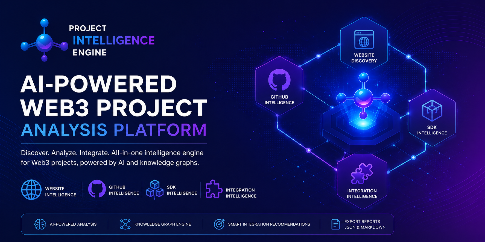
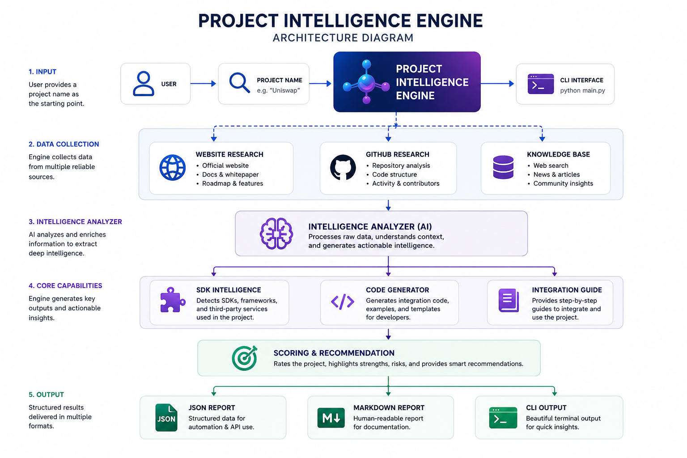

<p align="center">
  
</p>

<h1 align="center">🚀 Project Intelligence Engine</h1>

<p align="center">
AI-powered blockchain project intelligence and research framework.
</p>

<p align="center">


</p>

---

# 📖 Overview

Project Intelligence Engine automatically discovers official blockchain project resources and transforms them into structured intelligence.

Instead of manually browsing websites, GitHub organizations, documentation, SDKs, explorers, bridges, and ecosystem information, the engine performs automated research and produces professional reports.

Designed for:

- Blockchain Researchers
- Protocol Integrators
- Ecosystem Teams
- Developer Relations
- Technical Due Diligence
- Community Contributors

---

# ✨ Features

## 🌐 Website Intelligence

- Official website discovery
- Metadata extraction
- Social media detection
- Documentation discovery

---

## 🏢 GitHub Intelligence

- Organization discovery
- Repository ranking
- Official repository detection
- Repository statistics
- Activity analysis

---

## 🧠 Project Intelligence

- Category detection
- Blockchain detection
- SDK detection
- Token discovery
- Testnet detection
- Mainnet detection
- Explorer detection
- Bridge detection

---

## 📊 AI Analysis

- Project Intelligence Score
- Executive Summary
- Strength Analysis
- Risk Analysis
- Integration Recommendation

---

## 💻 Developer Support

- SDK Discovery
- Integration Guide
- Code Generator
- Multi-language examples

Supports

- Python
- JavaScript
- TypeScript

---

## 📄 Reports

Export to

- Markdown
- JSON

Professional reports ready for research documentation.

---

## 🏗️ Architecture

<p align="center">
  
</p>

---

## 🎬 Demo

<p align="center">
  
</p>

> Demo showing the complete Project Intelligence Engine workflow from project input to AI-generated analysis.

---

## ✨ Features

# 📂 Project Structure

```
Airdrop-Research-Assistant/

├── analyzer/
├── researcher/
├── scanner/
├── reporter/
├── models/
├── skills/
├── assets/
├── reports/
├── tests/
├── utils/

main.py
config.py
README.md
```

---

# 🚀 Quick Start

Clone repository

```bash
git clone https://github.com/YOUR_USERNAME/Airdrop-Research-Assistant.git

cd Airdrop-Research-Assistant
```

Install

```bash
pip install -r requirements.txt
```

Run

```bash
python main.py
```

or

```bash
python demo.py
```

---

# 🎬 Demo

<p align="center">


</p>

---

# 🖥 CLI Preview

<p align="center">


</p>

---

# 📈 Workflow

```text
Project Name
      │
      ▼
Website Discovery
      │
      ▼
GitHub Discovery
      │
      ▼
Repository Ranking
      │
      ▼
Project Analysis
      │
      ▼
SDK Detection
      │
      ▼
AI Summary
      │
      ▼
Integration Guide
      │
      ▼
Export Report
```

---

# 🎯 Example Output

```
Project: Superfluid

Website:
https://www.superfluid.org

Category:
Money Streaming Protocol

Blockchains:
Ethereum
Base
Optimism
Polygon
Arbitrum

Official GitHub:
superfluid-org

Repositories:
48

SDK:
Detected

Project Score:
92 / 100
```

---

# 🌍 Use Cases

- Ecosystem research

- Due diligence

- Protocol integration

- Hackathon preparation

- Airdrop research

- Developer onboarding

- Project comparison

---

# 🛣 Roadmap

## Phase 1

- Website Intelligence

- GitHub Intelligence

- Repository Ranking

- AI Summary

✅ Completed

---

## Phase 2

- Better CLI

- Better Reports

- Project Scoring

- SDK Detection

- Integration Guide

🚧 In Progress

---

## Phase 3

- Multi-chain Intelligence

- AI Chat Interface

- Plugin System

- Web Dashboard

- API Support

📅 Planned

---

# 🤝 Contributing

Pull requests are welcome.

For major changes, please open an issue first to discuss the proposed improvements.

---

# 📜 License

MIT License

---

<p align="center">

Built with ❤️ for the blockchain ecosystem.

</p>

_Last updated: July 2026_